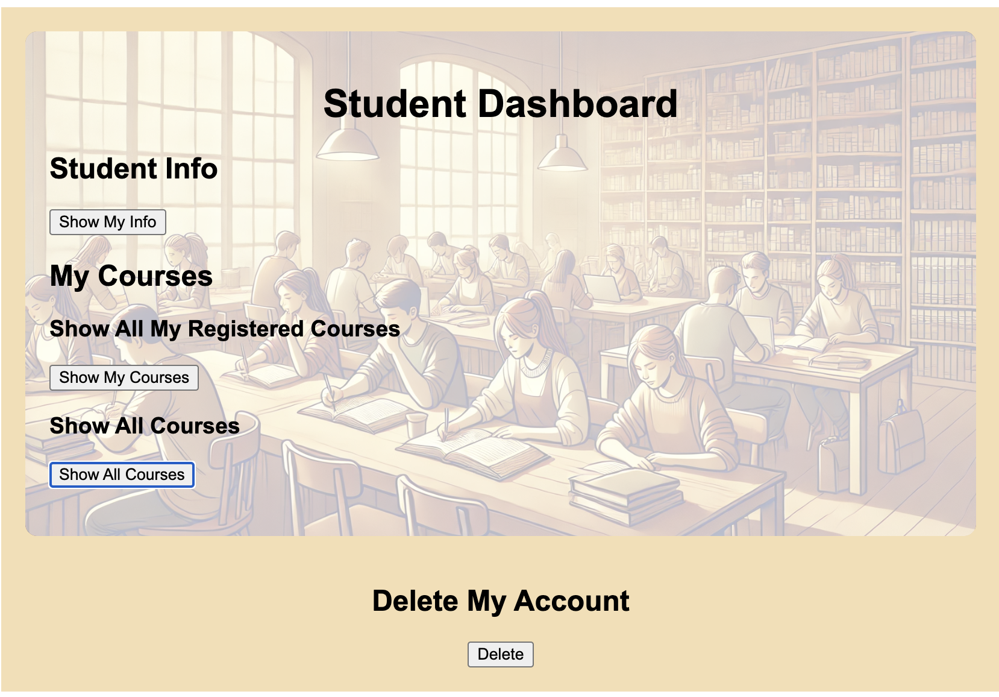

# Online-Education-Platform

## Introduction
This project originated as an assignment for the Database Management System course. It is a full-stack website, with the backend developed using Spring Boot and the frontend built with Vue 3. The project simulates basic functionalities within a school setting, such as students selecting courses and leaving reviews, teachers updating new chapters for courses and viewing feedback, and administrators managing users.

## To run the project
Backend:  
IntelliJ is recommended for running backend.  
MySQL is required for the database. Choosing other databases may require additional configuration.  
To set up the database configuration, go to `src/main/resources/application.properties` and change the `spring.datasource.url`, `spring.datasource.username`, and `spring.datasource.password` to your own database configuration.

Frontend:
Follow the instructions in this url:https://docs.npmjs.com/downloading-and-installing-node-js-and-npm to install node.js and npm.  
To run the frontend, go to the folder where the frontend files are, then  run this command in your terminal: 
```bash
npm run dev  
```
Packaging the frontend: npm run build

## Demo
#### The Login Page


#### The Student Page


## Note
The project is still in development and may contain many bugs.  
There are missing functions, if you want to play with it a bit, you may need to add some data to the database manually.  
For instance, you can manually add a course:  

INSERT INTO Courses (id, name, description, lecturer_id, enable, capacity)
VALUES ('CS101', 'Introduction to Computer Science', 'A basic course on computer science fundamentals.', 123, true, 50);

Adjustments and modifications will continue to be updated.


